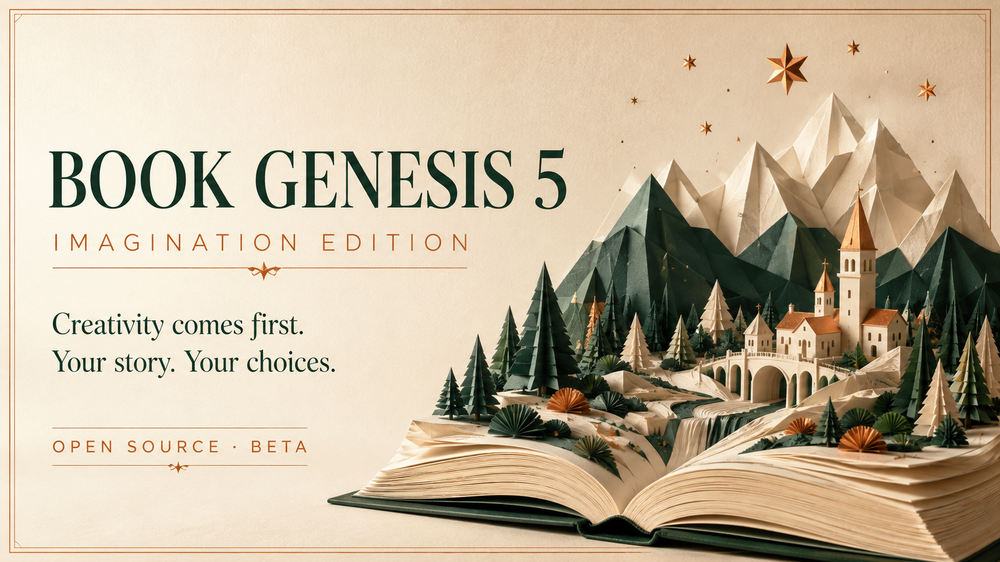
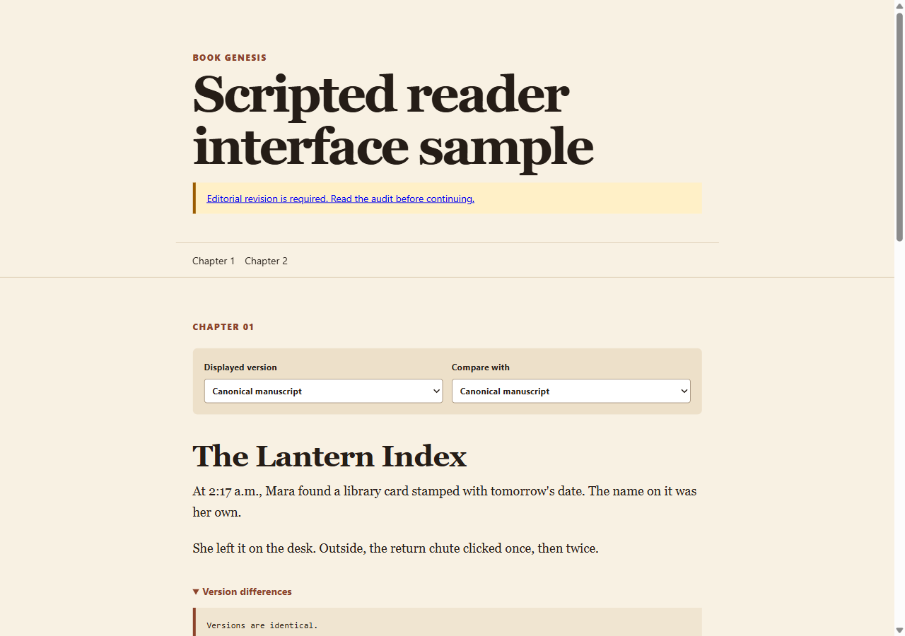
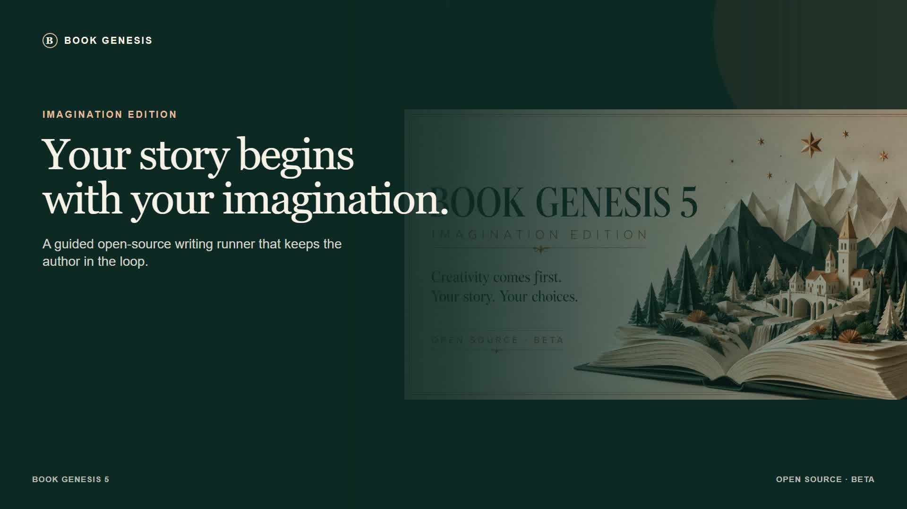
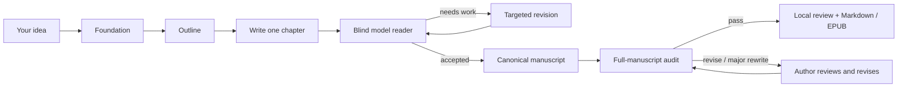

<div align="center">



# Book Genesis 5 — Imagination Edition

### A writing studio for people with an idea worth following.

**Bring the spark. Keep the authorship. Let a rigorous, local-first workflow help you turn it into a manuscript.**

[](https://github.com/felipelobomotta-blip/book-genesis-v4/actions/workflows/test.yml)
[](LICENSE)
[](ROADMAP.md)
[](README.md)

[Get started](#get-started) · [How it works](#how-it-works) · [See the workflow](docs/architecture.md) · [Read the vision](docs/vision.md) · [Join the beta](#make-it-better-with-us)

</div>

> Creativity is the point. Book Genesis is built to give more people a serious path from an unfinished idea to a book-shaped work — without handing authorship to a black box.

Book Genesis is an open-source CLI for developing fiction and nonfiction with AI models you choose. It turns one premise into a guided writing session: foundation, outline, chapter drafts, blind model-reader feedback, a manuscript audit, a local reading experience, and Markdown or EPUB exports.

It does not promise a bestseller. It gives a creator an inspectable process, saves the work on disk, and makes a manuscript-level editorial objection impossible to ignore.



[Explore the reader sample](examples/reader-demo/README.md). This is a scripted interface demonstration; it is not a quality sample from a model-generated book.

## Watch it in a minute

[](https://github.com/felipelobomotta-blip/book-genesis-v4/releases/download/v5.0.0-beta.1/book-genesis-5-walkthrough-en.mp4)

**[Watch the 60-second walkthrough](https://github.com/felipelobomotta-blip/book-genesis-v4/releases/download/v5.0.0-beta.1/book-genesis-5-walkthrough-en.mp4)** · [33-second vertical cut](https://github.com/felipelobomotta-blip/book-genesis-v4/releases/download/v5.0.0-beta.1/book-genesis-5-vertical-en.mp4) · [Subtitles, source, and instructions](docs/video-walkthrough.md)

English narration, recorded CLI output, and real reader interactions. Story content is a labeled scripted fixture; the video is edited for time.

## The promise

Book Genesis supports the work around the pages: deciding what the story is, protecting the author’s notes, testing whether a chapter holds attention, and keeping the trail of revisions visible.

The author stays in charge. At the brief, the outline, and the first chapter, you can accept the direction or write a note. That note becomes a durable part of the project. Press `q` to stop safely; resume later from the exact point you left.

Project files are saved locally. Prompts and manuscript text are sent to the model providers you choose; use a local model route if you want local inference. Drafts, verdicts, artifacts, and warnings remain inspectable in the project folder.

## Get started

### 1. Install and connect a model

You need Python 3.10+ and one way to run a model: Claude Code, Codex CLI, an API-backed provider, a local model server, a declared external CLI, or manual copy/paste mode.

```bash
git clone https://github.com/felipelobomotta-blip/book-genesis-v4.git
cd book-genesis-v4
python -m pip install -e .

book-genesis setup
book-genesis doctor
```

`setup` helps you connect the tools already available on your machine. API keys are entered privately or read from your environment; they are not committed to the repository. Model calls and any associated provider costs remain yours.

### 2. Start with one sentence

```bash
book-genesis new \
  --idea "A night-shift librarian discovers a catalog entry that predicts who will disappear next." \
  --language en \
  --path books/the-return-date
```

Use the guided session to review the brief, outline, and first chapter. Press Enter to continue, type a note to redirect the work, or press `q` to stop.

```bash
book-genesis resume books/the-return-date
book-genesis review books/the-return-date --open
book-genesis export books/the-return-date --format epub
```

No provider yet? Start in manual mode. Book Genesis writes the prompt files, waits for you to paste each response, and resumes from there.

```bash
book-genesis new --manual --idea "Your premise" --language en --path books/my-story
```

For scripts and CI, add `--yes`. For a bounded test run, use `--chapters N`.

## How it works



Each chapter is judged from the prose itself, rather than from the writer’s plan. When you configure different model families, the writer and reader can be separated. Chapter one can go to a panel of distinct reader personas. If only one family is available, the run records that warning.

The final audit reads the canonical manuscript. If it returns `revise` or `major_rewrite`, the project is blocked at audit: score and package do not continue. Read the report, change the manuscript, and resume. A later audit must return `pass`.

This is a safeguard, not a claim that model feedback replaces an editor or human readers.

## What you get on disk

```
books/the-return-date/
├── artifacts/                 # brief, outline, audit, editorial materials
├── manuscript/
│   ├── chapters/              # accepted canonical chapters
│   └── drafts/                # retained attempts
├── evaluations/               # blind-reader verdicts
├── review/index.html          # self-contained local reader
├── exports/                   # Markdown or EPUB exports
└── RUN_REPORT.md              # trace of the run and its warnings
```

The reader page supports chapter navigation, attempt history, version comparison, and the audit report. `export` writes only canonical chapters and refuses accidental overwrites unless you explicitly pass `--overwrite`.

## Bring the tools you already use

| What you have | Connection |
| --- | --- |
| Claude Code or Codex CLI | Uses your existing logged-in CLI session. |
| OpenAI-compatible or Anthropic API | Configure it through `book-genesis setup`. |
| Ollama or LM Studio | Use a local server through setup. |
| Another command-line agent | Declare a small adapter in `~/.book-genesis/adapters.yaml`. |
| A chat window only | Use `--manual` and paste replies when ready. |

The recommended configuration uses more than one model family, but it is not mandatory. See the [quick start](docs/quickstart.md) and [architecture](docs/architecture.md) for details.

## Built to be questioned

The current release is a controlled beta. The codebase has **279 local tests** from the verified September 2026 quality pass, including recovery, history integrity, audit blocking, export, packaging, and reader flows. A real one-chapter smoke test found a structural ending problem that a favorable model-reader panel had missed; that finding led to the audit gate that now blocks completion. Read the [validation record](docs/validation.md).

What has not been proven yet matters too: Book Genesis has not established bestseller potential, human-reader preference, long-book consistency, or frictionless onboarding for people new to the terminal. The product should be evaluated with real writers, editors, and readers before publication claims are made.

## Make it better with us

If you are a writer, editor, researcher, designer, or builder, try it on an idea you care about and tell us where the process breaks, surprises you, or earns its place.

- Read [CONTRIBUTING.md](CONTRIBUTING.md) to improve the project.
- Check [ROADMAP.md](ROADMAP.md) for the beta work that would make it more useful.
- Read [CHANGELOG.md](CHANGELOG.md) for release history.
- Open a GitHub issue with a reproducible problem, a workflow story, or a better editorial question.

Book Genesis is MIT licensed. You direct the creative work and retain editable project files.

## Learn more

- [Quick start](docs/quickstart.md)
- [Architecture](docs/architecture.md)
- [Vision](docs/vision.md)
- [Validation and known limits](docs/validation.md)
- [A worked example: *Data de Devolução*](examples/data-de-devolucao/README.md)

---

Built in public by [Felipe Lobo](https://github.com/felipelobomotta-blip). If this helps an idea become a real work, star the repository, share the workflow with a writer, and show us what you make.

## The Astra-assisted update

Imagination Edition was developed with assistance from **Astra in Codex**, independent review, and recorded software tests. This describes the engineering work; Astra is not a required runtime provider, and the project is not an official OpenAI product. See [what changed](CHANGELOG.md) and the [complete launch kit](marketing/README.md).
