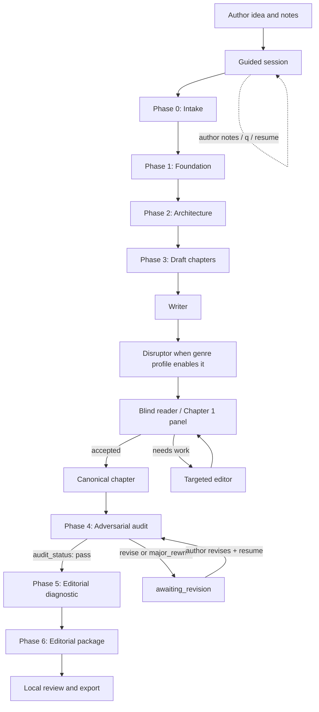
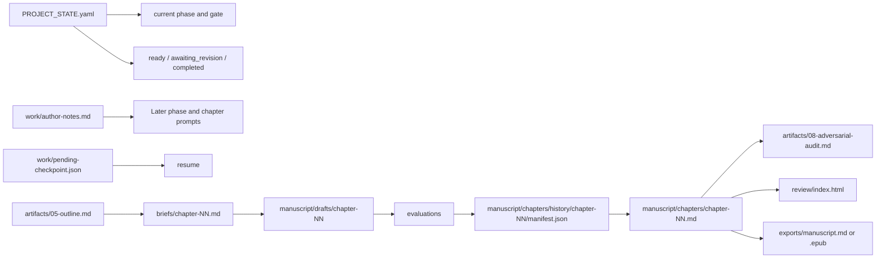

# Architecture

Book Genesis is a local Python runner. Models return text; the runner owns state, file writes, output validation, recovery, and phase transitions. This boundary keeps a project inspectable and avoids granting a provider direct control over the project directory.

## System map

The seven named stages are Intake, Foundation, Architecture, Drafting, Audit, Score, and Package. The phase named Score produces an editorial diagnostic; the final internal Genesis Score card is calculated separately from recorded run signals after completion. `run-phase` operates phases 0–2 and 4–6. Drafting uses the chapter loop so that each chapter has its own brief, candidate drafts, verdicts, and revision history.

## Provider boundary

Adapters send prompt text to a configured model route and receive text back. The built-in choices include Claude and Codex CLIs, OpenAI-compatible and Anthropic-compatible HTTP providers configured by `setup`, declared command adapters in `adapters.yaml`, and manual mode. `fake` is test-only.

The runner validates the expected file markers in phase replies before publishing them. It stages a complete response and a publication journal before replacing phase artifacts, then can recover a leftover journal on the next invocation. This is application-level recovery for interrupted writes; it is not a claim of hardware-level durability under every kind of power loss.

Claude is called in its safe mode with tools disabled. Codex is called in a temporary directory with an ephemeral read-only sandbox and a text-only output contract. Generic command adapters have the permissions and behavior of the command the author declares. The project does not claim universal tool isolation across all hosts or third-party CLIs.

## Project state and files

The history manifest records attempts, draft paths, verdict paths, status, and SHA-256 links. The score checks that an accepted verdict is linked to the current canonical chapter; it does not silently treat a modified file as previously accepted.

The guided session has three optional interactive checkpoints: the brief after Intake, the outline after Architecture, and chapter 1 after the blind read. Enter accepts; free text becomes `work/author-notes.md`; `q` writes a pending checkpoint. `resume` reads that file and restarts at the pending decision. In a non-interactive terminal or with `--yes`, those checkpoints are skipped.

## Editorial gates

At chapter level, the judge receives prose and the previous chapter's tail, not the outline or writer notes. It can compare revisions and preserve the better draft. Chapter 1 can use a three-persona blind model-reader panel; `--human` replaces that automatic continuation with an explicit author approval.

At manuscript level, the audit receives the canonical chapters and relevant artifacts. Its response needs exactly one standalone `audit_status` declaration. `pass` advances. `revise` or `major_rewrite` publishes the audit report, keeps Phase 4 current, sets `status: awaiting_revision`, and returns process exit code 4. No score or editorial package is produced in that state. The author changes the manuscript outside the runner and resumes for a new audit. Automatic structural repair is deliberately absent.

The Genesis Score is generated only after completion. It weights model-reader panel behavior (40%), first-draft acceptance (30%), accepted chapters (20%), and immediate remembered details (10%). It is an internal process signal. It does not calibrate literary quality, validate a human audience, establish editorial readiness, or forecast sales.

## Context and long-form limit

Chapter briefs deliberately use the chapter outline, story engine, characters, configured genre profile, and the final 300 words of the previous chapter. The full manuscript audit intentionally includes every canonical chapter without silent truncation so it can catch cross-book failures. That design means a sufficiently long manuscript may exceed a provider context window or time out. The current beta does not implement chunked audit synthesis with equivalent guarantees; long-form continuity needs dedicated validation before it can be claimed as solved.

## Local outputs

`book-genesis review` builds a self-contained HTML reader with version comparison and audit status. `book-genesis export` creates canonical Markdown or EPUB 3 files. Both operate locally; neither uploads work. Export labels incomplete projects as partial and protects source manuscript files from being overwritten.
